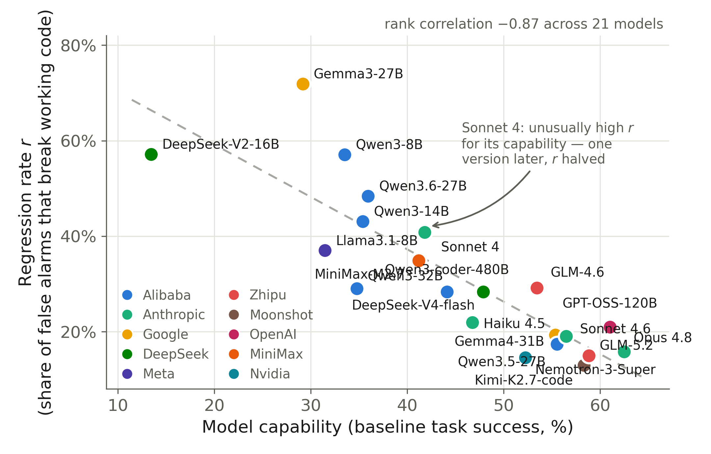

# Trust Leaderboard: which models can safely consume unfiltered static-analyzer feedback?

*Updated 2026-07-17 · 16 models · ranked by the **counterfactual regression rate r** (lower = better): the probability that the model, handed a **false-positive** security finding on its own working code, "fixes" it and breaks the code.*

| # | Model | Developer | r (95% CI) | q | τ\* | Best fixed policy | JP@0 | HumanEval | FP/TP trials | Notes |
|--:|---|---|---|--:|--:|---|--:|--:|--:|---|
| 1 | **Claude Opus 4.8** | Anthropic | 0.16 [0.09, 0.27] | 0.28 | 0.36 | naive | 62.5% | 99.4% | 57/36 |  |
| 2 | **Qwen3.5-27B** | Alibaba | 0.17 [0.09, 0.31] | 0.35 | 0.33 | naive | 55.5% | 96.3% | 46/37 |  |
| 3 | **Claude Sonnet 4.6** | Anthropic | 0.19 [0.16, 0.23] | 0.45 | 0.30 | naive | 56.5% | 98.8% | 420/679 | in-sample |
| 4 | **Gemma4-31B** | Google | 0.19 [0.15, 0.24] | 0.38 | 0.33 | naive | 55.4% | 100.0% | 321/341 | in-sample |
| 5 | **Claude Haiku 4.5** | Anthropic | 0.22 [0.18, 0.26] | 0.33 | 0.40 | naive | 46.8% | 96.3% | 460/675 | in-sample |
| 6 | **Qwen3-coder-480B** | Alibaba | 0.28 [0.19, 0.41] | 0.43 | 0.40 | naive | 44.1% | 96.3% | 60/95 |  |
| 7 | **DeepSeek-V4-flash** | DeepSeek | 0.28 [0.19, 0.40] | 0.62 | 0.31 | naive | 47.9% | 97.0% | 67/103 |  |
| 8 | **Qwen3-32B** | Alibaba | 0.29 [0.21, 0.39] | 0.62 | 0.32 | naive | 34.8% | 97.6% | 100/192 |  |
| 9 | **GLM-4.6** | Zhipu | 0.29 [0.20, 0.41] | 0.53 | 0.36 | naive | 53.4% | — | 72/51 | retired by provider |
| 10 | **Llama3.1-8B** | Meta | 0.37 [0.22, 0.56] | 0.41 | 0.47 | naive | 31.5% | 59.1% | 27/95 |  |
| 11 | **Claude Sonnet 4** | Anthropic | 0.41 [0.34, 0.48] | 0.23 | 0.64 | selective | 41.8% | — | 196/177 | in-sample, retired by provider |
| 12 | **Qwen3-14B** | Alibaba | 0.43 [0.34, 0.52] | 0.57 | 0.43 | naive | 35.4% | 96.3% | 116/212 |  |
| 13 | **Qwen3.6-27B** | Alibaba | 0.48 [0.32, 0.65] | 0.50 | 0.49 | naive | 36.0% | 98.8% | 31/42 |  |
| 14 | **Qwen3-8B** | Alibaba | 0.57 [0.50, 0.64] | 0.45 | 0.56 | selective | 33.5% | 93.9% | 212/397 | in-sample |
| 15 | **DeepSeek-V2-16B** | DeepSeek | 0.57 [0.33, 0.79] | 0.35 | 0.62 | selective | 13.4% | 42.1% | 14/57 |  |
| 16 | **Gemma3-27B** | Google | 0.72 [0.55, 0.84] | 0.35 | 0.67 | selective | 29.2% | 87.8% | 32/97 |  |

## How to read this

- **r (regression rate)** — of the loop interactions where the analyzer's
  finding was a *false alarm* on already-clean code, the fraction where the
  model's "fix" broke the code (introduced a vulnerability or failed tests).
  This is the leaderboard's ranking key: it measures whether a model can
  *recognize* a false alarm instead of blindly obeying it.
- **q (fix rate)** — of the interactions where the finding was real, the
  fraction the model actually fixed (secure *and* still passing tests).
- **τ\* = r/(q+r)** — the minimum per-rule precision at which surfacing a
  finding helps this model more than it hurts. Feed the model a finding only
  if the rule's historical precision exceeds its τ\*.
- **Best fixed policy** — the better of the two deployed fixed policies:
  *naive* (surface everything) vs *selective* (surface only rules with >50%
  precision). "Naive" does **not** mean surfacing everything is optimal — the
  optimum filters at the model's own τ\*, which is above zero for every model.
- **JP@0** — baseline JointPass (functionally correct AND vulnerability-free
  before any feedback) on the 51-item core benchmark; the capability axis.
- **HumanEval** — external capability axis (pass@1, 164 tasks); missing for
  models retired before that experiment.
- *in-sample* — one of the five models used to formulate the r-law; all
  others were measured prospectively, after the law and decision rule were
  frozen.

## The headline finding

Across these models, r falls steeply as capability rises (Spearman −0.89) —
**better models are less gullible** — while q stays flat. So the optimal
feedback policy is a property of the *model*, slides from "filter
aggressively" toward "surface everything" as models improve, and expires with
every model update. Full study: *Better Models Are Less Gullible: Selective Feedback
for LLM Code Agents under Noisy Static Analysis* (under review at Empirical Software Engineering; the submitted
state is preserved as tag
[`emse-2026-07`](../../releases/tag/emse-2026-07)).

## Measurement notes

- Estimates pool the naive+selective runs on the 51-item core benchmark
  (CWEval + SecurityEval), combined Semgrep+Bandit analyzer, multi-seed;
  models re-measured on several dates contribute one pooled row.
- Claude Fable 5 could not be measured: its safety classifiers refused 9/10
  generation requests on this benchmark (see `data/smoke_tests/`).
- Regenerate this file: `python scripts/make_leaderboard.py`.
